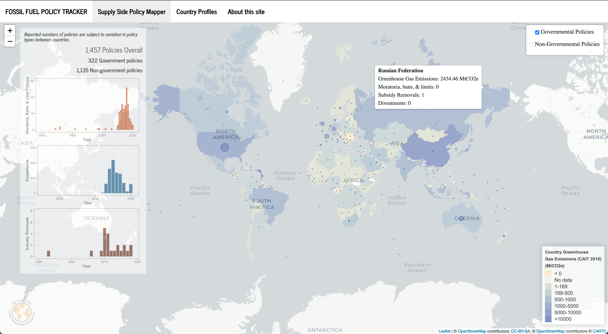

## Fossil Fuel Policy Tracker & Interactive Mapping Tool

This github page contains the code and input data for the [Fossil Fuel Policy Tracker & Interactive Mapping Tool](https://fuenal.shinyapps.io/FFTNP_tracker-master/) developed by the Fossil Fuel Non-Proliferation Treats Initiative.

Input data are obtained from the [Sussex University github page](https://profiles.sussex.ac.uk/p104921-peter-newell).

The Shiny app, first launched on [19th March 2021](https://theconversation.com/coronavirus-outbreak-a-new-mapping-tool-that-lets-you-scroll-through-timeline-131422), aims to complement existing Climate Change and Fossil Fuel mapping dashboards (such as those developed by the [the Grantham Research Institute on Climate Change and the Environment](https://www.climate-laws.org/#map-section) and the [Climate Action Tracker](https://climateactiontracker.org)) with a particular focus on supply-side policies, including a Fossil Fuel City Impact Map to help organizations to identify best practices in the field and facilitate target city choices by provinding a propensity action score. 

## Shiny interface

Follow [this](https://fuenal.shinyapps.io/FFTNP_tracker-master/) link for the interactive Shiny app. A screenshot of the interface is provided below.

 

## Analysis code

Key elements of the analysis code are as follows:
- *CAT_data_daily.R* – an R script that extracts and reformats information from the [Fossil Fuel Divestment Weppage](https://gofossilfree.org/divestment/commitments/). The output files are saved in the *input_data* folder.
- *app.R* - an R script used to render the Shiny app. This consists of several plotting functions as well as the ui (user interface) and server code required to render the Shiny app. The script has become more complex over time as a growing number of interactive features has been added.
- *input_data* - a folder containing dynamic input data relating to the evolving supply-side policy tracking(updated by *CAT_data_daily.R*) and static input data relating to previously identified and categorized policy database and country mapping coordinates.

## Updates

The [Shiny app](https://fuenal.shinyapps.io/FFTNP_tracker-master/) automatically updates itself based on the code in *CAT_data_daily.R*. 

## Other resources

Several resources proved invaluable when building this app, including:

- The [nCov_tracker by Dr Edward Parker and Quentin Leclerc](https://github.com/eparker12/nCoV_tracker);

- A [tutorial by Florianne Verkroost](https://rviews.rstudio.com/2019/10/09/building-interactive-world-maps-in-shiny/) on building interactive maps;

- The [SuperZIP app](https://shiny.rstudio.com/gallery/superzip-example.html) and [associated code](https://github.com/rstudio/shiny-examples/tree/master/063-superzip-example);

- The [RStudio Leaflet tutorials](https://rstudio.github.io/leaflet/).

## Author
Dr Fatih Uenal, Fellow @ Faculty AI & University of Cambridge

## Contact
mars.fatih@gmail.com
# FFNPT_Tracker
